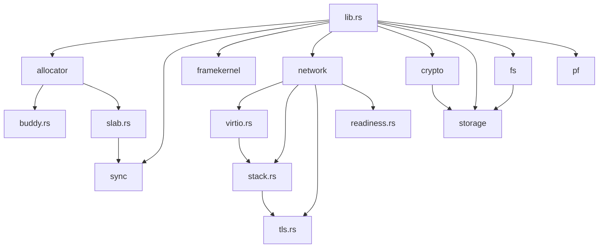
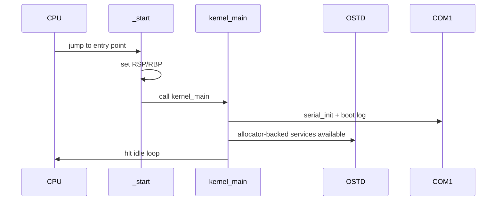
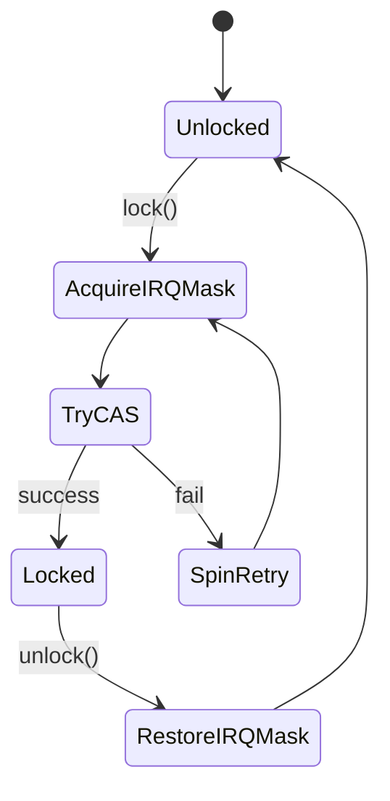
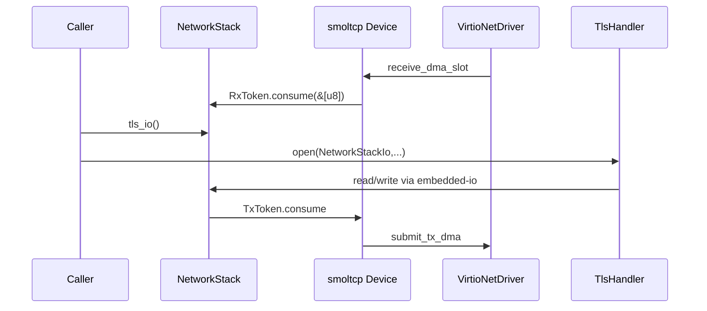
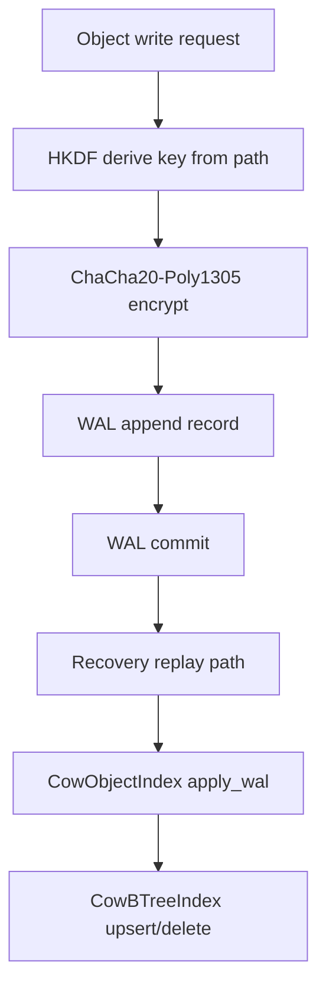
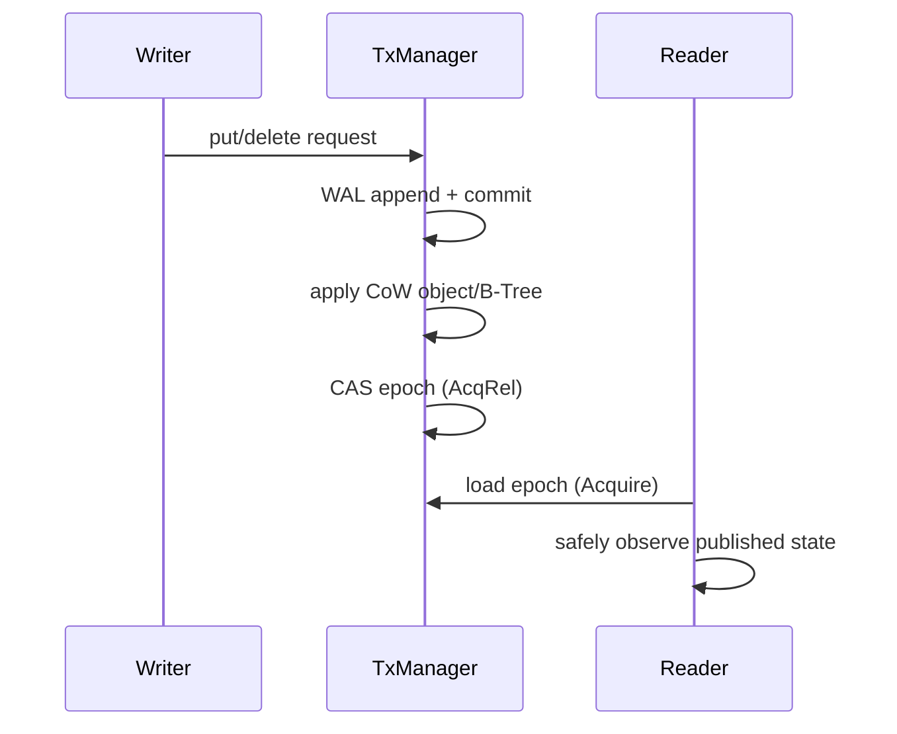
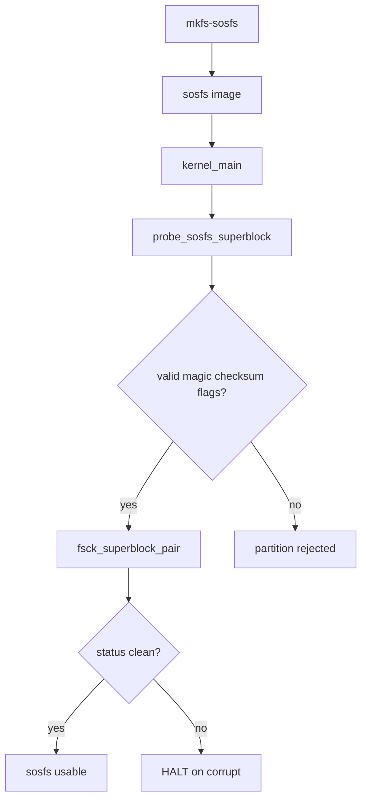

# Architecture Notes

This document maps the current repository implementation to the S.O.S.
framekernel roadmap, including completed Phase 2 networking, Phase 3
cryptography/storage foundations, and initial Phase 7/8 userland-control
surfaces.

## Module map



## Boot and framekernel runtime

- `_start` in `src/bin/main.rs` sets a known stack pointer and enters
  `kernel_main`.
- `kernel_main` initializes COM1 and emits boot diagnostics.
- The kernel then idles in an `hlt` loop.
- `OSTD` in `src/framekernel.rs` provides the core allocator-backed runtime
  surface and singleton allocator bootstrap.



## Memory subsystem

### Buddy allocator (`src/allocator/buddy.rs`)

- Manages power-of-two blocks using order-based intrusive free lists.
- Allocation: locate first available order, split downward.
- Deallocation: insert and recursively merge buddy blocks.

```mermaid
flowchart TD
    Req[alloc(layout)] --> Ord[compute required order]
    Ord --> Scan{free list has block?}
    Scan -- no --> Up[next higher order]
    Up --> Scan
    Scan -- yes --> Pop[pop block]
    Pop --> Split{order > required?}
    Split -- yes --> PushBuddy[split + push buddy]
    PushBuddy --> Split
    Split -- no --> Ret[return ptr]
```

### Slab allocator (`src/allocator/slab.rs`)

- Fixed-size object slots over a pre-provisioned memory region.
- Uses atomic bitmap bit operations for fast claim/release.
- Forms the core buffer source for networking DMA slots.

## Synchronization model (`src/sync.rs`)

- `Spinlock` disables local interrupts before CAS lock attempts.
- Failed lock attempts briefly restore interrupt state before retry.
- `Mutex<T>` builds scoped guarded access atop `Spinlock`.
- `AtomicSlabBitmap` offers lock-free slot tracking.



## Phase 2 networking stack

### VirtIO facade (`src/network/virtio.rs`)

- Exposes MMIO init/status/feature negotiation hooks.
- Maintains slab-backed frame slot ring.
- Provides explicit DMA lifecycle:
  - `alloc_dma_buffer`
  - `submit_tx_dma`
  - `receive_dma_slot`
  - `release_dma_buffer`

### smoltcp integration (`src/network/stack.rs`)

- Implements `smoltcp::phy::Device` for `VirtioNetDriver`.
- RX token reads directly from DMA memory and releases slot after consume.
- TX token writes packet bytes directly into slab DMA buffers.
- Configures TCP behavior (nagle/keepalive/ack-delay/timeout profile).

### TCP window scaling and RTT calibration (`src/network/stack.rs`)

- `TcpWindowScaler::recommended_window_bytes` computes BDP-inspired target.
- `calibrate_buffers` derives rx/tx sizes and effective scaling.
- `apply_rtt_profile` applies dynamic config based on RTT.

### TLS 1.3 integration (`src/network/tls.rs` + `src/network/stack.rs`)

- `TlsHandler` wraps `embedded-tls` blocking API with state machine tracking.
- `NetworkStackIo` adapts the TCP stack to `embedded-io` Read/Write traits.
- Integration tests cover:
  - failure-path wiring on isolated network stack,
  - successful handshake with local mocked rustls server transcript.



## Validation status

- `cargo test -q` passing.
- `cargo test -q --features tls13` passing.
- `cargo clippy` passing.

## Phase 3 cryptography and storage

### Crypto module (`src/crypto/mod.rs`)

- HKDF-SHA256 based path-key derivation:
  - `PathCrypto::path_hash`
  - `PathCrypto::derive_object_key`
- ChaCha20-Poly1305 AEAD helpers:
  - `encrypt_in_place`
  - `decrypt_in_place`

### WAL module (`src/storage/mod.rs`)

- Encodes WAL records into fixed-size blocks with magic/version/checksum.
- Persists records through a `WalBlockDevice` trait.
- Supports append, commit, replay, and tail/head recovery after corruption.

### CoW indices (`src/storage/mod.rs`)

- `CowObjectIndex` publishes map snapshots by atomic active-slot switch.
- `CowBTreeIndex` publishes B-Tree root snapshots by atomic active-slot switch.
- B-Tree entries are fixed-size and kept sorted for deterministic lookup.



### Phase 3 integration tests

- Crypto key-binding and AEAD roundtrip tests (`src/crypto/mod.rs`).
- WAL commit/replay and recovery corruption tests (`src/storage/mod.rs`).
- CoW object index and CoW B-Tree publication tests (`src/storage/mod.rs`).
- End-to-end Phase 3 flow test:
  encrypt -> WAL append/commit -> replay -> index apply -> decrypt verify
  (`src/storage/mod.rs`).

## Phase 4 hardening and verification (in progress)

### Atomic transaction manager (`src/storage/mod.rs`)

- `AtomicTransactionManager` integrates transaction state transitions:
  - `InFlight` -> `Committed`/`Aborted`
  - WAL append/commit ordering before index publication
- CoW object + B-Tree publication occurs before epoch CAS bump.

### CAS + memory ordering strategy

- Epoch publication uses CAS (`compare_exchange_weak`) with `Ordering::AcqRel`.
- Readers use `Ordering::Acquire` on epoch/status reads.
- Writer side uses `Ordering::Release` status publication.



### Phase 4 verification tests added

- Atomic transaction put/delete commit path.
- Recovery replay rebuilding object/B-Tree indices.
- Acquire/Release visibility litmus test validating publication ordering.
- High-load stress test validating transaction durability and replay equivalence
  across thousands of operations.
- Epoch monotonicity test ensuring CAS-based publication progresses safely under
  repeated updates.
- Soak runner script for repeated release-mode execution:
  `scripts/phase4-stress.sh`.

## Phase 5 native filesystem and tooling (implemented)

- `sosfs` on-disk specification in `docs/sosfs.md`.
- Canonical 8-byte magic: `"SOSFS\0\0\0"`.
- Formatter CLI: `mkfs-sosfs` (`src/bin/mkfs_sosfs.rs`).
- Checker CLI: `fsck-sosfs` (`src/bin/fsck_sosfs.rs`).
- fsck core library in `src/fs/sosfs.rs`:
  - `validate_superblock()` - validate single superblock
  - `fsck_superblock_pair()` - validate mirror pair with strict mode
- Boot integration: fsck runs after partition recognition, halts on corruption.
- Serial logs: `[sos] fsck: clean`, `[sos] fsck: corrupt`, `[sos] fsck: HALT`



## Phase 7 post-boot readiness checks (implemented)

- Readiness suite in `src/network/readiness.rs` models deterministic checks:
  ICMP reachability, DNS resolution path, and HTTPS connectivity gate.
- `sos-readiness` CLI (`src/bin/sos_readiness.rs`) executes the suite and
  returns non-zero when readiness is not achieved.
- Tests cover all-pass and partial-failure scenarios to enforce gate semantics.

## Phase 8 `sos-pf` packet filter control plane (implemented)

- YAML schema and validation in `src/pf/mod.rs`:
  - root `sos-pf.tables[]`
  - table family validation (`ip`, `ip6`, `inet`, `arp`, `bridge`, `netdev`)
  - chain type/hook/policy validation
  - sets/maps schema and reference validation
  - payload/conntrack match validation
  - action validation (`accept`, `drop`, `reject`, `log`, `snat`, `dnat`,
    `masquerade`, `redirect`, `limit`)
- Atomic apply planning:
  - full nft batch script generation (`flush ruleset` + add table/set/map/chain/rule)
  - NAT, rate-limit, conntrack, payload, and set-reference rule rendering
- Runtime integrations:
  - dry-run preflight via `nft -c -f -`
  - apply via `nft -f -`
  - kernel ruleset export via `nft -j list ruleset` + JSON->YAML bridge
- `sos-pf` CLI (`src/bin/sos_pf.rs`):
  - `check --config <path>` for dry-run schema + kernel parsing validation
  - `apply --config <path>` for atomic transaction application
  - `export --config <path>` for YAML export/canonicalization path
  - `export-running` for live kernel state export to `sos-pf` YAML
- Tests follow TDD and cover parser/schema, apply plan rendering, runner-based
  dry-run/apply behavior, and ruleset JSON export mapping.

## Phase 9 console bring-up and service boundaries (implemented initial scope)

- Interactive serial console starts automatically during boot after fsck.
- Command loop provides prompt-driven dispatch (`sos> `) with line input,
  backspace handling, and command execution result reporting.
- Builtin shell-level commands (`help`, `programs`) are resolved by
  `ConsoleService` without crossing privileged service boundaries.
- Service layering in `src/console/mod.rs`:
  - `ConsoleService` (command parsing + loop)
  - `ProgramService` (program dispatch boundary)
  - `PfService` (`sos-pf` control boundary)
- Kernel-side `PacketFilterControl` now keeps runtime policy state (applied/staged
  + generation counter) behind a mutex-protected control object, so console-level
  execution never writes hardware/control state directly.
- `sos-pf status` is now a dedicated message path (`PfMessage::Status`) to query
  runtime state without conflating it with export payloads.

## Phase 10-13 execution/runtime hardening (implemented in current scope)

- Program metadata/ABI descriptor is now explicit (`ProgramDescriptor`, `ProgramAbi`)
  and queryable via console (`help <program>`).
- Program lifecycle supervision contracts are implemented in `ProgramService`:
  `Spawn`, `Wait`, and `Terminate`, with task-handle tracking.
- Process-isolation primitives now live in `src/process/mod.rs`:
  - isolated address-space descriptors with non-overlap assertions
  - process runtime with spawn/load/map/context-install/switch/terminate paths
  - executable header parser (`SOSX`) carrying ABI and entry metadata
  - bounded IPC bus with endpoint registration and routed message queues
  - virtual-memory context operation trait (`VmContextOps`) for architecture-specific
    page mapping and context install hooks
- Structured machine-readable response codes are emitted (`sos-code: ...`) for
  successful and failed control operations.
- Console UX hardening includes bounded command history ring and deterministic
  fallback messaging (`reader unavailable`, `command failed`).
- Boot-to-console determinism is instrumented with:
  - mandatory boot self-check transcript
  - prompt budget constant (`BOOT_PROMPT_BUDGET_MS`)
  - prompt-at timing emission in boot logs
- This preserves framekernel/microkernel intent by separating command parsing,
  program dispatch, and privileged service actions behind explicit message-like
  request/response contracts.
