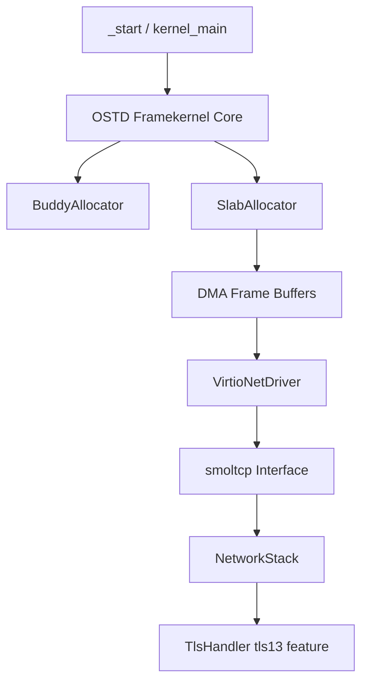
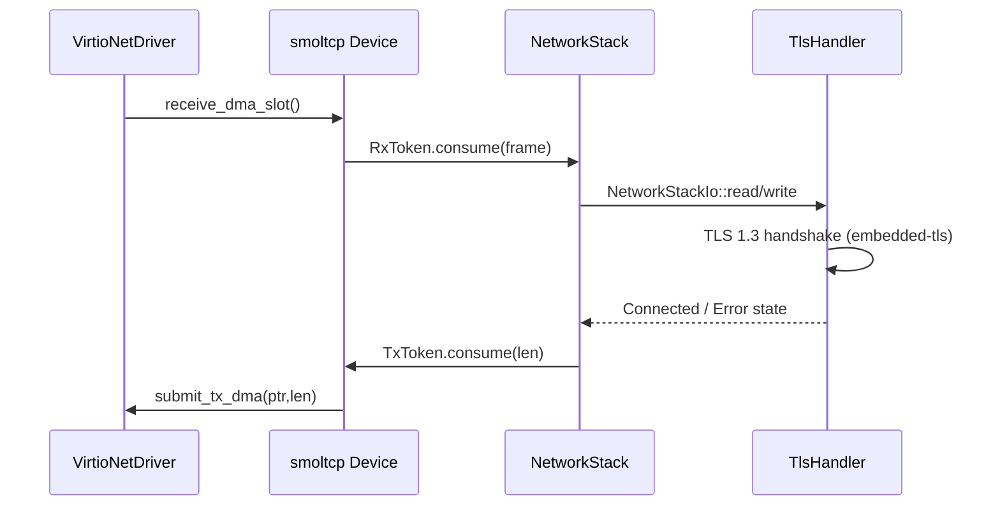
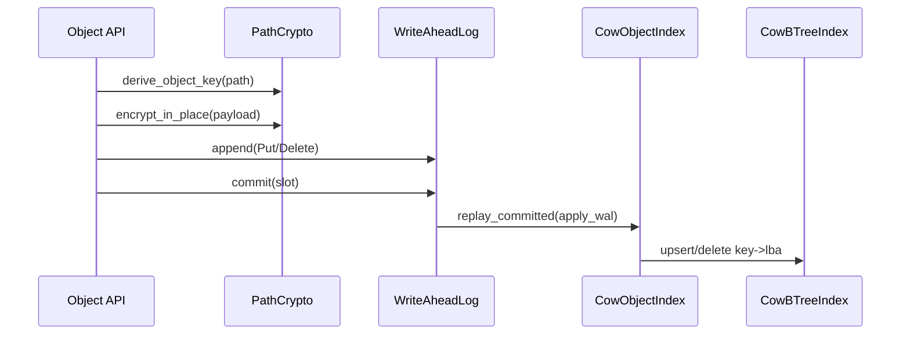
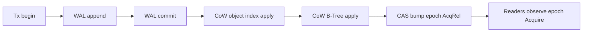

# S.O.S. (Streamed-Object Operating System)

S.O.S. is a Rust-first framekernel prototype focused on bare-metal, low-overhead
data-plane primitives: allocator architecture, synchronization, network stack
integration, and optional TLS 1.3 transport wiring.

## Current status

- Phase 1 foundations are in place: buddy/slab allocators, spin-based sync,
  and OSTD bootstrap surface.
- Phase 2 network stack integration is implemented: VirtIO facade, smoltcp
  device integration with slab-backed DMA paths, TCP window/RTT tuning, and
  embedded-tls integration points.
- Phase 3 cryptography and storage foundations are implemented: HKDF path-key
  derivation, ChaCha20-Poly1305 AEAD, persistent WAL encode/commit/replay,
  recovery flow, copy-on-write object index, and copy-on-write fixed-fanout
  B-Tree index surface.
- Phase 4 hardening and verification has started: atomic transaction manager
  integration, lock-free CAS epoch publication path, and memory-ordering
  visibility tests for Acquire/Release semantics.
  It now also includes high-load stress tests and epoch monotonicity checks.
- Phase 5 native filesystem and tooling: sosfs format, mkfs-sosfs formatter,
  fsck-sosfs checker with strict mode, boot-time fsck gate with hard-fail halt.

## Implemented modules

- `src/allocator/buddy.rs`: power-of-two allocator with split/merge coalescing.
- `src/allocator/slab.rs`: fixed-size lock-free slot allocator.
- `src/sync.rs`: interrupt-aware spinlock and `Mutex<T>` wrapper.
- `src/framekernel.rs`: OSTD allocator bootstrap and global allocator wiring.
- `src/network/virtio.rs`: VirtIO network driver facade and DMA slot lifecycle.
- `src/network/stack.rs`: smoltcp integration and socket/runtime tuning APIs.
- `src/network/tls.rs`: optional TLS 1.3 handler over `embedded-tls`.
- `src/fs/sosfs.rs`: sosfs superblock format helpers and partition probe logic.
- `src/crypto/mod.rs`: HKDF-SHA256 path-key derivation and ChaCha20-Poly1305
  authenticated encryption helpers.
- `src/storage/mod.rs`: WAL block-device layer, crash recovery replay, COW
  object index, COW B-Tree index primitives, and atomic transaction manager.
- `src/bin/main.rs`: boot stub, serial diagnostics, and idle loop.
- `src/bin/mkfs_sosfs.rs`: `mkfs.sosfs` formatter CLI for disk images.
- `src/bin/fsck_sosfs.fs`: `fsck.sosfs` checker CLI with strict mode.

## Runtime architecture



## Network/TLS flow



## Phase 3 storage/crypto flow



## Test and lint

- Unit tests: `cargo test -q`
- TLS-enabled tests: `cargo test -q --features tls13`
- Lints: `cargo clippy`
- Phase 4 soak stress (release): `./scripts/phase4-stress.sh 100`
- Make target for soak stress: `make phase4-stress ITER=100`

## Phase 4 atomic/CAS flow



For deeper design notes and module-level diagrams, see `ARCHITECTURE.md`.

## sosfs formatter quickstart

```bash
# Format a new filesystem image
cargo run --features "std,crypto" --bin mkfs-sosfs -- --image sosfs.img --blocks 32768
```

## sosfs checker quickstart

```bash
# Check a filesystem image (non-strict mode)
cargo run --features std --bin fsck-sosfs -- --image sosfs.img

# Check in strict mode (any issue results in corrupt status)
cargo run --features std --bin fsck-sosfs -- --image sosfs.img --strict
```

Exit codes:
- 0 = clean
- 1 = warn (non-strict only)
- 2 = corrupt
- 3 = io/usage error

Formatter notes are also in `tools/sosfs-mkfs/README.md`.
