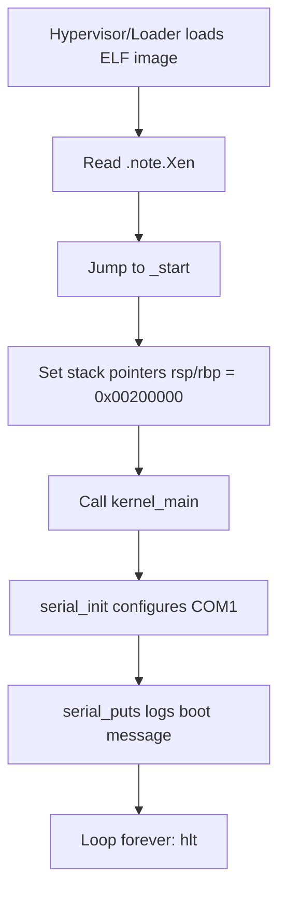
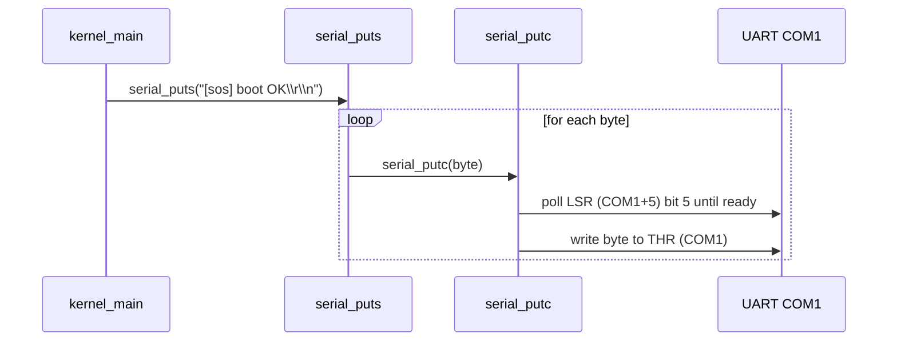

# SOS `src/bin` Boot Stub Documentation

This directory contains a very small `no_std` Rust binary intended to boot in a Xen-oriented environment and emit basic status logs over a serial port.

## What this code does

- Defines a Xen ELF note (`.note.Xen`) that points to `_start`.
- Provides low-level x86 port I/O helpers (`inb`/`outb`).
- Initializes the COM1 UART (16550-compatible).
- Prints a boot marker (`[sos] boot OK`) over serial.
- Enters an idle loop using `hlt`.

## High-level boot flow



## Serial pipeline



## Memory/link layout

```mermaid
flowchart TB
    A[ELF image base 0x00100000] --> B[.note]
    A --> C[.text + .rodata]\npage-aligned
    A --> D[.data]\npage-aligned
    A --> E[.bss]\npage-aligned
```

## Important implementation notes

- `#![no_std]` and `#![no_main]`: no Rust runtime, allocator, or default entry point.
- `_start` is the first Rust-visible symbol and manually sets up stack state.
- Panic handling only logs a fixed message and halts forever.
- UART output is polling-based (no interrupts), which keeps early-boot behavior deterministic.

## File guide

- `src/bin/main.rs`: entry point, serial driver primitives, panic handler, idle loop.
- `src/bin/linker.ld`: linker script that places sections and preserves ELF notes.
